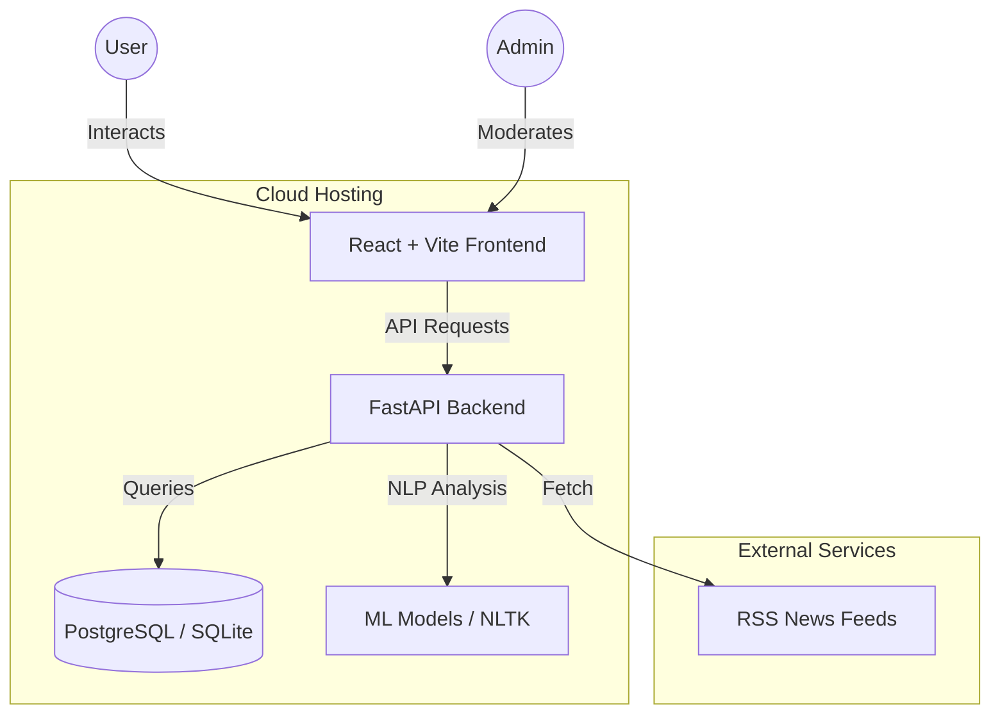

# 📰 TruthLens — News Credibility & Media Literacy Platform

TruthLens is a web-based platform designed to help users evaluate the credibility of news articles through transparent analysis, visual explanations, and community-driven insights.

Instead of labeling news as simply true or false, TruthLens focuses on **credibility signals**, **language patterns**, and **media literacy**, empowering users to make informed judgments.

---

## 🆔 Problem Statement

**Problem Statement ID:** PS009  
**SDG Mapped:** SDG 16 — Peace, Justice and Strong Institutions  

**Theme:** Miscellaneous  

### Problem Description

Develop a web-based platform that helps users evaluate the credibility of news by:

- Aggregating articles and managing sources  
- Allowing user submissions of news content  
- Displaying community feedback and credibility scores  
- Providing transparency through visual explanations  
- Educating users with basic media literacy insights  

---

## 🎯 Objective

TruthLens aims to strengthen public trust in information systems by:

- Encouraging critical thinking  
- Increasing transparency in news evaluation  
- Reducing the impact of emotionally manipulative content  
- Promoting responsible news consumption  

---

## 🧱 System Architecture



---

## ✨ Key Features

### 👤 User & Admin Dashboards
- Role-based views for users and administrators.
- Centralized management of articles and credibility insights.

### 📰 Content Submission
- Submit articles via text or URL.
- Automatic content extraction for analysis.

### 📊 Credibility Scoring System
- Score range: **0–100**.
- Visual credibility indicators.
- Status-based interpretation instead of binary labels.

**Credibility States**
- 🟢 Widely Corroborated  
- 🟡 Under Review  
- 🔴 High Risk / Contested  

### 🧠 Explainable AI (XAI)
- Inline article highlighting:
  - 🔴 Emotional / hype-driven language.
  - 🟢 Factual / numeric statements.
- Clear explanation of how credibility score was influenced.

### ⭐ Community Feedback
- Users can rate and review articles.
- Supports collective credibility assessment.

### 📈 Visualization Dashboard
- Visual credibility indicators.
- Simplified interpretation for non-technical users.

### 📘 Media Literacy Insights
- Educational guidance on:
  - Emotional framing
  - Source reliability
  - Misinformation patterns
  - Responsible reading practices

---

## 🛠️ Tech Stack

- **Frontend**: React (Vite), Tailwind CSS, Shadcn/UI, Axios, Recharts.
- **Backend**: FastAPI (Python), SQLAlchemy, Pydantic, JWT Authentication.
- **Database**: PostgreSQL (Production), SQLite (Local).
- **Analysis**: NLTK, Scikit-learn, Custom Credibility Engine.
- **Deployment**: Render (Backend), Vercel (Frontend).

---

## 🚀 Quick Start (Local)

### 1. Clone the repository
```bash
git clone https://github.com/Khvshal/HM106_JoyBoys.git
cd HM106_JoyBoys
```

### 2. Start the Application
The easiest way is to use the provided batch script:
```bash
# Windows
run.bat
# or via PowerShell
./run.ps1
```

### 3. Manual Startup
**Backend**:
```bash
cd hackmatrix-backend
pip install -r requirements.txt
python main.py
```
**Frontend**:
```bash
cd frontend_lovable
npm install
npm run dev
```

---

## ☁️ Deployment

### Backend (Render)
1. Use the provided `render.yaml` Blueprint.
2. Select **Blueprint** on Render dashboard and connect your repo.

### Frontend (Vercel)
1. Import the `frontend_lovable` directory to Vercel.
2. Set `VITE_API_URL` environment variable to your backend URL.
3. Configure `vercel.json` for SPA routing (already included).

---

## 🔄 How It Works

1. User submits a news article (text or URL).
2. Article content is extracted automatically.
3. NLP and ML models analyze:
   - Emotional language
   - Factual indicators
   - Linguistic credibility patterns
4. A credibility score and status are generated.
5. Inline highlights and explanations are displayed.
6. Users can review and provide feedback.

---

## 👥 Contributors

**Team JoyBoys**
- [Khushal](https://github.com/Khvshal)
- [Meet]
- [Pranav]

---

## 📄 License
This project is licensed under the MIT License.
